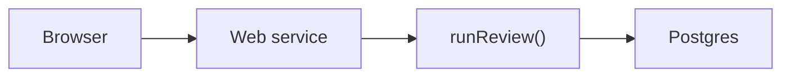
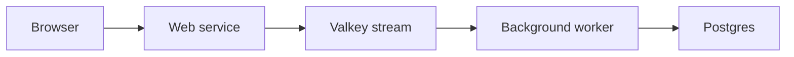
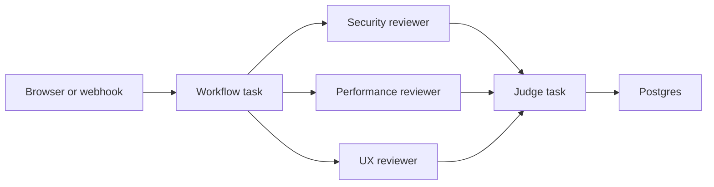

# From Demo to Deploy: Building Agents with Render Workflows

Bulleted slides for the localhost:2026 workshop. Speaker notes are under each
slide.

---

## Slide 1: Title

**Building Production-Grade Agents with Render Workflows**

localhost:2026

**Notes**

Hello. I am < Intro yourself >. Today, we're going to build and deploy agents on Render. We'll start simple, with a naive implementation that breaks at scale. Then, we'll look at a more sophisticated architecture that can support scale, but adds complexity. Last, we'll take a look at Render Workflows, which offers a simple way to build and deploy agents with scalability, orchestration, and observability built-in.

---

## Slide 2: One Pipeline, Three Execution Substrates

**The agent stays the same. The execution model changes.**

- A PR goes in. A verdict comes out.
- `prepareDiff -> filterDiff -> [ security | performance | ux? ] -> judge`
- Four specialist agents with tools and an LLM loop
- Agent orchestration is a workflow problem first, an AI problem second.

| Pattern | Substrate | Orchestration | Failure mode | Scale |
| --- | --- | --- | --- | --- |
| Pattern 1 | Request-bound web service | None | Timeouts, lost work on deploy | No |
| Pattern 2 | Web service + queue + worker | Queue, acknowledgments, consumer group, retries | Coordination bugs | Yes |
| Pattern 3 | Render Workflows | Managed | App logic | Yes |

**Notes**

We have one code-review pipeline: fetch a PR, filter out noise, fan out specialist reviewers in parallel, then a judge consolidates findings into an approve-or-request-changes verdict. The agents are defined once in a shared package. What changes is the infrastructure that runs them. Agents are going to production, and the hard parts are everything around the model call: orchestration, observability, durability, retries, isolation, and scale. So the question becomes: how much of that infrastructure do you build and maintain yourself?

---

## Slide 3: Setup and First Run

**Get everyone to a working agent before the first lab**

- Fork the repo into your GitHub account.
- In GitHub Actions, run `setup-attendee.yml` to create your namespace.
- Clone your fork locally.
- Run `npm install`, then `npm run setup`.
- Deploy Pattern 1 from `packages/naive-agent/render.yaml`.
- Open the Web Service URL and submit the demo PR.
- Click a run to inspect findings and spans.

**Repo map**

- `shared/agent/`: agents, LLM loop, tools, model client
- `shared/db/`: telemetry store, backed by Postgres or memory
- `shared/ui/`: review viewer, shared by all three patterns
- `packages/naive-agent/`: Pattern 1
- `packages/worker-agents/`: Pattern 2
- `packages/workflow-agents/`: Pattern 3

**Notes**

This should be a guided code-along, not a deep exercise. The tutorial companion has the exact steps, so the slide should stay at checkpoint level. Start from GitHub so every attendee gets their own fork and generated namespace before they clone locally. Then walk through install, `npm run setup`, and the Pattern 1 deploy. Pattern 1 is worth doing with attendees because it gets them acclimated to the repo, the Render Dashboard, the deployed app, and the review viewer. The goal is a first success moment: everyone has a live agent, everyone has submitted a PR, and everyone has seen a trace. This is an npm workspaces monorepo. Every pattern imports the same agents, tools, and model client.

---

## Slide 4: Pattern 1: The Naive Agent

**The simplest thing that works**



- The agent runs *inside* the HTTP request.
- `POST /api/reviews` -> `await runReview(prUrl)` -> respond with verdict.
- One import: `runReview` from `@workshop/agent`.
- The viewer shows findings and spans: LLM turns, tool calls, everything.
- It works. Ship it?

**Notes**

This is the starting point every agent tutorial gives you. The handler awaits the entire review pipeline: four agents, multiple LLM round-trips, tool calls, and only then responds. Open the viewer, submit a PR, and watch it complete. The findings are real. The traces show every LLM turn. It works. So what's the problem?

---

## Slide 5: Break It

**Three ways Pattern 1 fails**

- **Timeouts:** a large PR or slow model blocks the request. The proxy kills it.
- **Lost on deploy:** redeploy mid-review, and in-flight work disappears.
- **No scale:** concurrent users share one process. Parallel reviewers contend for one box.

**Notes**

DEMO: Talk through submitting a large PR and watching the request hang, or talk through what happens when you redeploy while a review is in progress. There's nowhere for the work to live outside this process. The problem isn't the agent. The problem is the execution model. We need to separate the thing that accepts the request from the thing that does the work.

---

## Slide 6: Pattern 2: Queue + Worker

**Durability by owning the coordination layer**



- The web tier becomes a thin producer: enqueue and return `202`.
- A background worker consumes a Valkey stream and runs `runReview`.
- The agent code is identical: same import, same function.
- You gain durability, async responses, and worker-based scale.
- You now own the queue.

**Notes**

DEMO: Submit a PR and get back `202` immediately. Tail the worker logs and show the review running in the background. Open an SSE stream and watch progress events arrive in real time. Scale to two workers and show the consumer group splitting load. Kill the web service mid-review and show the worker keeps going. This is powerful. But now open `kv.ts`.

---

## Slide 7: The Price of Durability

**Everything in `kv.ts` is coordination code you now own**

- Redis Stream: `XADD` / `XREADGROUP`
- Consumer group with named consumers
- Blocking reads with `BLOCK 5000`
- Message acknowledgments: `XACK` on success, leave pending on failure
- Pub/sub progress bus: `PUBLISH` / `SUBSCRIBE`
- A consumer loop that must never crash

**Notes**

The stream. The consumer group. Blocking reads. Message acknowledgments. Retries. The pub/sub bus for progress. The consumer loop that has to keep running even when a handler fails. These are all now your concern. This is the price of durability when you own the substrate.

---

## Slide 8: Lab 1: Hand-Write Message Acknowledgments

**Implement `processEntry` in `kv.ts`**

- Handle one delivered stream entry.
- On success, call `XACK` so the group never redelivers it.
- On failure, don't ack and don't rethrow.
- Verify with `npm run test:worker`.
- You just implemented at-least-once delivery.

**Notes**

This is Session 1's hands-on. Open `processEntry` in `packages/worker-agents/src/kv.ts`. It currently throws. Your job: parse the entry, run the handler, then acknowledge the message on success. In Redis Streams, that acknowledgment is the `XACK` command. If the handler throws, log and return: never ack, never rethrow. The ack goes inside the try, after the handler. The catch logs and returns. Two tests flip from red to green: one checks that a success is acked, one checks that a failure stays pending. Give it 10 minutes.

---

# Break

---

# Session 2: Let the Platform Do It (~45 min)

---

## Slide 9: Pattern 3: Render Workflows

**Same fan-out. Zero coordination code.**



- Each agent runs as a Render `task()` in its own isolated container.
- `task()` = a config object + an async function.
- Retries, timeouts, compute size, and traces are declarative.
- Composition is function calls: call a task from a task, `Promise.all` to fan out.
- The queue, consumer group, acknowledgments, and pub/sub are gone.

**Notes**

This is the payoff. Same pipeline, same agents, same tools. But now every reviewer runs as its own Render task: isolated, retried, traced. The entire coordination layer from `kv.ts` collapses into a config object: `retry: { maxRetries: 2, waitDurationMs: 1000 }`. You don't write a queue. You don't write message acknowledgments. You don't manage a consumer group. You write a function and a config. Render does the rest.

---

## Slide 10: The `task()` Bridge

**A config object plus an async function**

```ts
task(agent.name, async (input, runId?) => {
  return agent.run(input, { tracer, runId });
});
```

```ts
export default task(
  {
    name: "your-review",
    timeoutSeconds: 120,
    retry: { maxRetries: 2, waitDurationMs: 1000, backoffScaling: 2 },
  },
  async function yourReview(input) {
    // your logic: any async function
  },
);
```

| You write | Render gives you |
| --- | --- |
| `retry: { maxRetries: 2, ... }` | automatic retries with backoff, in a fresh instance |
| `await someTask(input)` | isolation: each task runs in its own container |
| nothing | a full trace of every task and sub-task |

**Notes**

This is `agentTask.ts`, and it's the only Pattern 3-specific abstraction. `agent.run()` is the same call naive-agent and worker-agents make. Wrapping it in `task()` is what buys isolation, retries, and traces. The retries you hand-wrote in Lab 1, the ack inside the try and the catch that swallows errors, are now `maxRetries: 2`. Same guarantee, but expressed as config.

---

## Slide 11: Lab 2: Author a Task

**Your turn: extend `your-review`**

1. Preview it: `render workflows tasks list --local`.
2. Compose an agent as a task:
   ```ts
   const securityTask = agentTask(securityReviewer);
   const review = await securityTask({ patches });
   ```
3. Force a retry: `if (Math.random() < 0.5) throw new Error("flaky!");`
4. Fan out: `REVIEWERS.map(agentTask)` + `Promise.all`.
5. Ship it live: push, release, start the task, open the trace.

**Notes**

Open `your-review/index.ts`. It fetches a diff and returns an overview. It's your turn to extend it. Compose an agent as a nested task. Force a failure and watch the retry. Fan out all reviewers. Each step has a payoff, and each step reinforces the lesson: the capability is yours to write, the durability is the platform's. Coding agents welcome: the `task()` API is small enough that they can reason about it directly.

---

## Slide 12: What You Just Built

**A durable, traced, multi-agent workflow**

- Specialist agents fan out in parallel, each in its own container.
- Automatic retries with backoff, no try/catch or dead-letter queue.
- Full traces: every task, every LLM turn, every tool call.
- Zero queue code. Zero consumer groups. Zero acknowledgment logic.

**Notes**

The only infrastructure you wrote was a function and a config object. Everything else, including the queue, retries, isolation, and traces, is handled by the platform.

---

## Slide 13: Production Extensions

**The production frontier**

- **Evals:** a labeled corpus plus a scoring runner. Each case is a task.
- **Guardrails:** input sanitization, output validation, tool allow/deny lists.
- **Circuit breakers:** per-run budgets, model-tier fallbacks, backpressure caps.
- **MCP tools:** `defineMcpSource` makes a tool available to all three patterns at once.

**Notes**

Keep this short, or treat it as a backup slide if timing is tight. The point is not to introduce a new workshop. The point is to show that the same task pattern extends to production concerns: evals, guardrails, circuit breakers, and external tools.

---

## Slide 14: Takeaway and Resources

**Agents are the logic you write. Workflows are the infrastructure you don't.**

- Pattern 1: simple, but fragile
- Pattern 2: powerful, but you own the hard parts
- Pattern 3: same power, the platform owns the hard parts
- Repo: all three patterns, the mock model, the full test suite
- Docs: `docs/00` through `docs/05`
- Render Workflows: `render.com/docs/workflows`
- Bonus points: reflection loops, MCP tools, HITL gates in `docs/04-author-a-task.md`

**Notes**

Everything is in the repo. The guided docs walk through each pattern. The bonus points in `docs/04-author-a-task.md` cover a judge reflection loop, wiring in an MCP tool, and a human-in-the-loop gate. Each one reinforces the same lesson. The mock model means attendees can keep going with zero credentials. Thank you all.
